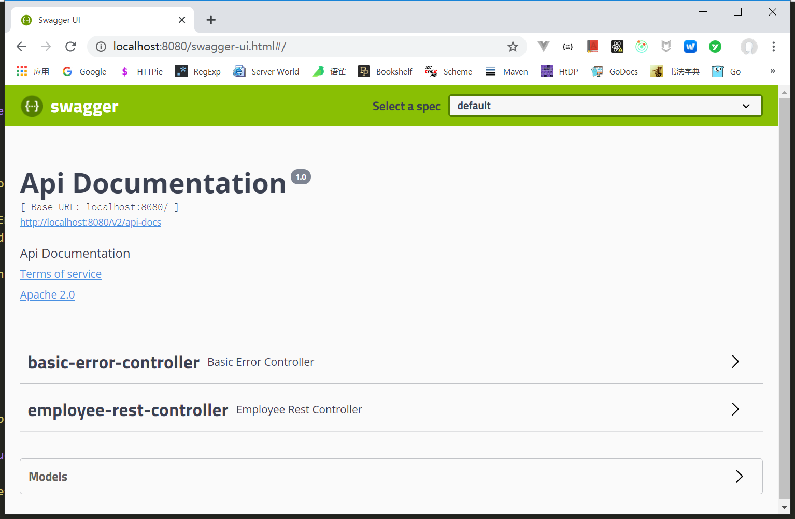
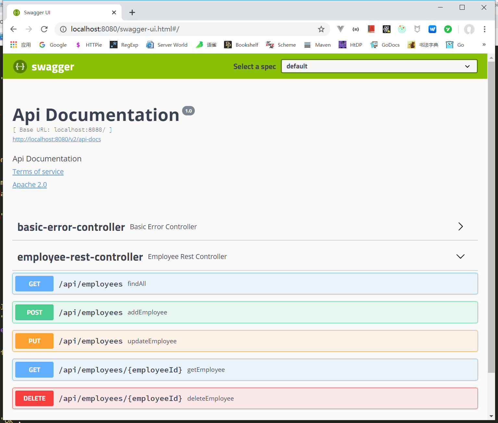
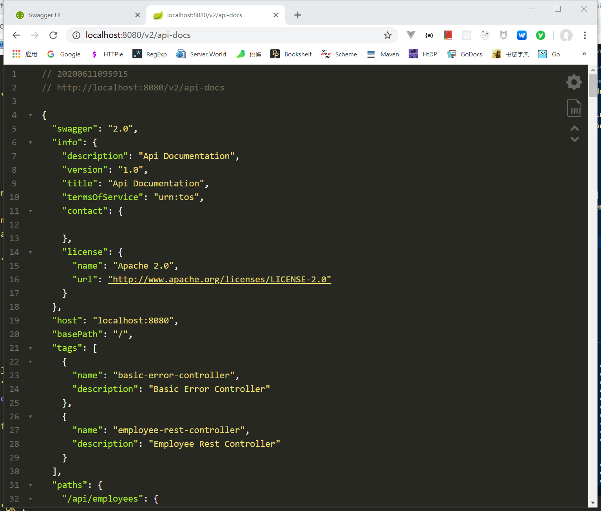

# Spring 自学

这是自己在学习 Spring 过程中的一点代码及记录。

## 准备 SQL

SQL script:

```mysql
CREATE DATABASE  IF NOT EXISTS `employee_directory`;
USE `employee_directory`;

--
-- Table structure for table `employee`
--

DROP TABLE IF EXISTS `employee`;

CREATE TABLE `employee` (
  `id` int(11) NOT NULL AUTO_INCREMENT,
  `first_name` varchar(45) DEFAULT NULL,
  `last_name` varchar(45) DEFAULT NULL,
  `email` varchar(45) DEFAULT NULL,
  PRIMARY KEY (`id`)
) ENGINE=InnoDB AUTO_INCREMENT=1 DEFAULT CHARSET=latin1;

--
-- Data for table `employee`
--

INSERT INTO `employee` VALUES 
	(1,'Leslie','Andrews','leslie@lavenliu.cn'),
	(2,'Emma','Baumgarten','emma@lavenliu.cn'),
	(3,'Avani','Gupta','avani@lavenliu.cn'),
	(4,'Yuri','Petrov','yuri@lavenliu.cn'),
	(5,'Juan','Vega','juan@lavenliu.cn');
```

## Swagger UI

为了时髦一点，我们为项目增加 `Swagger API` 支持。在 `pom.xml` 中增加依赖：

```xml
<dependency>
    <groupId>io.springfox</groupId>
    <artifactId>springfox-swagger2</artifactId>
    <version>2.9.2</version>
</dependency>

<dependency>
    <groupId>io.springfox</groupId>
    <artifactId>springfox-core</artifactId>
    <version>2.9.2</version>
</dependency>

<dependency>
    <groupId>io.springfox</groupId>
    <artifactId>springfox-swagger-ui</artifactId>
    <version>2.9.2</version>
</dependency>
```

增加依赖之后，就该创建一个配置文件，配置 `Docket Bean`。这个配置文件的目的是：

- 配置 `basePackage`
- 配置 `selectors`

创建完毕配置文件之后，框架就会自动做处理。一个基本的配置：

```java
package cn.lavenliu.app;

import org.springframework.context.annotation.Bean;
import org.springframework.context.annotation.Configuration;
import springfox.documentation.builders.PathSelectors;
import springfox.documentation.builders.RequestHandlerSelectors;
import springfox.documentation.spi.DocumentationType;
import springfox.documentation.spring.web.plugins.Docket;
import springfox.documentation.swagger2.annotations.EnableSwagger2;

@Configuration
@EnableSwagger2
public class SwaggerConfig {
   @Bean
   public Docket apiDocket() {

       Docket docket =  new Docket(DocumentationType.SWAGGER_2)
                .select()
                // .apis(RequestHandlerSelectors.basePackage("cn.lavenliu.app")) // 扫描具体的包
                .apis(RequestHandlerSelectors.any()) // 扫描所有包
                .paths(PathSelectors.any())
                .build();

       return docket;

    }
}
```

运行项目，即可看到效果。输入如下 `URL`：

- `localhost:8080/swagger-ui.html`
- `localhost:8080/v2/api-docs`

如下图所示：

效果图1：



效果图2：



效果图3：



## 遇到的问题

### DAO 层

`dao` 包下面有两个 `EmployeeDAO` 的实现，使用 `mvn` 打包时，有如下报错：

```java
arameter 0 of constructor in com.luv2code.springboot.cruddemo.service.EmployeeServiceImpl required a single bean, but 2 were found:
        - employeeDAOHibernateImpl: defined in file [C:\Users\NiMei\springdemo\target\classes\com\luv2code\springboot\cruddemo\dao\EmployeeDAOHibernateImpl.class]
        - employeeDAOJpaImpl: defined in file [C:\Users\NiMei\springdemo\target\classes\com\luv2code\springboot\cruddemo\dao\EmployeeDAOJpaImpl.class]
```

### JpaRepository

现在 `DAO` 层只需要写一个接口类 `EmployeeRepository.java` 即可。

### Spring Data REST

在 `pomx.xml` 文件中添加如下依赖：

```xml
<!-- Add dependency for Spring Data REST -->
<dependency>
  <groupId>org.springframework.boot</groupId>
  <artifactId>spring-boot-starter-data-rest</artifactId>
</dependency>
```

这样就没有必要 `rest` 包了。

### Thymeleaf

添加依赖：

```xml
<dependency>
  <groupId>org.springframework.boot</groupId>
  <artifactId>spring-boot-starter-thymeleaf</artifactId>
</dependency>
```

`entity` 包 及 `dao` 包就没有必要了。

### Thymeleaf CSS

在 `resources` 目录下面创建 `static/css` 目录， 然后创建 `CSS` 文件 `demo.css`，其内容如下：

```css
.funny {
    font-family: Impact, Haettenschweiler, 'Arial Narrow Bold', sans-serif;
    color: green;
}
```

修改 `helloworld.html` 文件，引入上面的 `CSS` 文件。在 `<head>` 标签中添加如下代码：

```html
<!-- reference CSS file -->
<link rel="stylesheet" th:href="@{css/demo.css}" />
```

运行项目即可查看页面效果。

## Spring Cloud

后续会加入 Spring Cloud 的一些使用示例。如：

- Spring Cloud Config
- Spring Cloud Eureka
- Spring Cloud Zuul

## Prometheus

项目中加入 `prometheus`，让我们对自己开发的服务更了如指掌。如：

- 项目接口的每天请求数量
- 状态码分别是多少，如：4xx，5xx

要想使用 `prometheus`，需要在 `pom.xml` 中引入对应的客户端即可。如下：

```xml
<dependency>
  <groupId>io.prometheus</groupId>
  <artifactId>simpleclient</artifactId>
  <version>0.3.0</version>
</dependency>
<dependency>
  <groupId>io.prometheus</groupId>
  <artifactId>simpleclient_hotspot</artifactId>
  <version>0.3.0</version>
</dependency>
<dependency>
  <groupId>io.prometheus</groupId>
  <artifactId>simpleclient_httpserver</artifactId>
  <version>0.3.0</version>
</dependency>
```

一个简单的测试代码：

```java
package cn.lavenliu.app;

import io.prometheus.client.Counter;
import io.prometheus.client.hotspot.DefaultExports;
import io.prometheus.client.exporter.HTTPServer;
/**
 * Hello world with Prometheus!
 *
 */
public class App {
 private static final Counter myCounter = Counter.build()
  .name("my_counter_total")
  .help("An example counter.").register();

    public static void main(String[] args) throws Exception {
        DefaultExports.initialize();
        HTTPServer server = new HTTPServer(8000);
        while (true) {
            myCounter.inc();
            Thread.sleep(1000);
        }
    }
}
```

测试一下：

```bash
(venv3.6) LavenLius-MacPro:my-app liuchuan$ http :8000/metrics |grep -v jvm
# HELP process_cpu_seconds_total Total user and system CPU time spent in seconds.
# TYPE process_cpu_seconds_total counter
process_cpu_seconds_total 0.59861
# HELP process_start_time_seconds Start time of the process since unix epoch in seconds.
# TYPE process_start_time_seconds gauge
process_start_time_seconds 1.552450248354E9
# HELP process_open_fds Number of open file descriptors.
# TYPE process_open_fds gauge
process_open_fds 19.0
# HELP process_max_fds Maximum number of open file descriptors.
# TYPE process_max_fds gauge
process_max_fds 10240.0
# HELP my_counter_total An example counter.
# TYPE my_counter_total counter
my_counter_total 92.0
```

